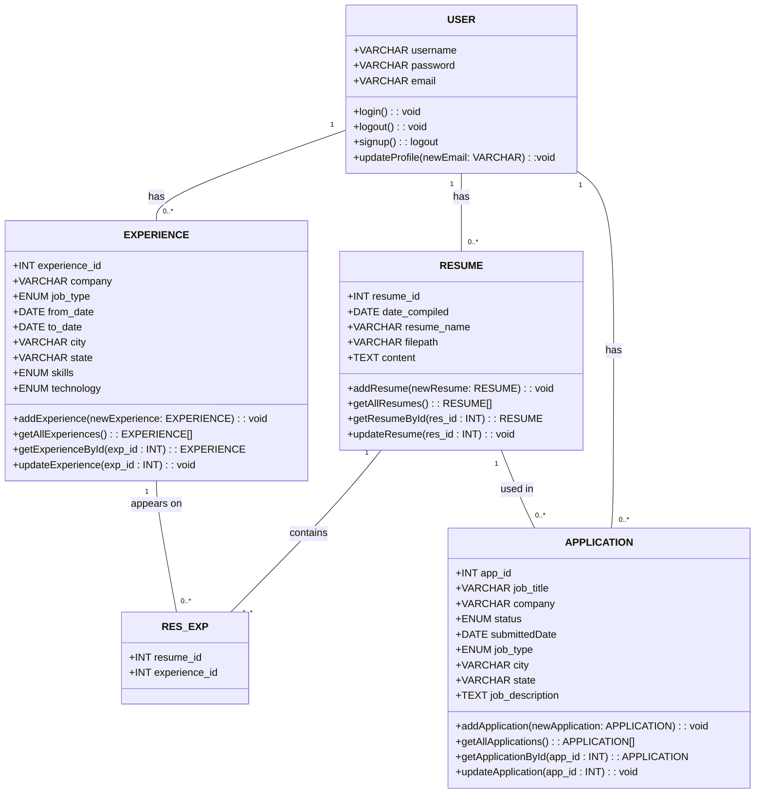

# Data

This document is on verion `1.1`

This file is responsible for representing the data structures used in ____. Below are the [Entity Relationship Diagram](#entity-relations) and the [Class Diagram](#class-diagram)

*Rendered with [Mermaid](https://mermaid.js.org/)*

## Entity Relations

```mermaid
erDiagram
    USER {
        VARCHAR username NOT NULL PK
        VARCHAR password NOT NULL
        VARCHAR email
    }
    EXPERIENCE{
        INT experience_id NOT NULL PK
        VARCHAR company NOT NULL
        ENUM job_type NOT NULL
        DATE from_date NOT NULL
        DATE to_date
        VARCHAR city
        VARCHAR state
        ENUM skills
        ENUM techonology
    }
    RESUME {
        INT resume_id NOT NULL PK
        DATE date_compiled NOT NULL
        VARCHAR resume_name NOT NULL
        VARCHAR filepath NOT NULL
        TEXT content
    }
    RES_EXP {
        INT resume_id NOT NULL FK
        INT experience_id NOT NULL FK
        PK(resume_id, experience_id)
    }
    APPLICATION {
        INT app_id NOT NULL PK
        VARCHAR job_title NOT NULL
        VARCHAR company NOT NULL
        ENUM status NOT NULL
        DATE submittedDate NOT NULL
        ENUM job_type
        VARCHAR city
        VARCHAR state
        TEXT job_description
    }

    USER ||--o{ EXPERIENCE : "has"
    USER ||--o{ RESUME : "has"
    USER ||--o{ APPLICATION : "has"
    EXPERIENCE ||--o{ RES_EXP : "appears on"
    RESUME ||--|{ RES_EXP : "contains"
    RESUME ||--o{ APPLICATION : "used in"
```

## Class Diagram

