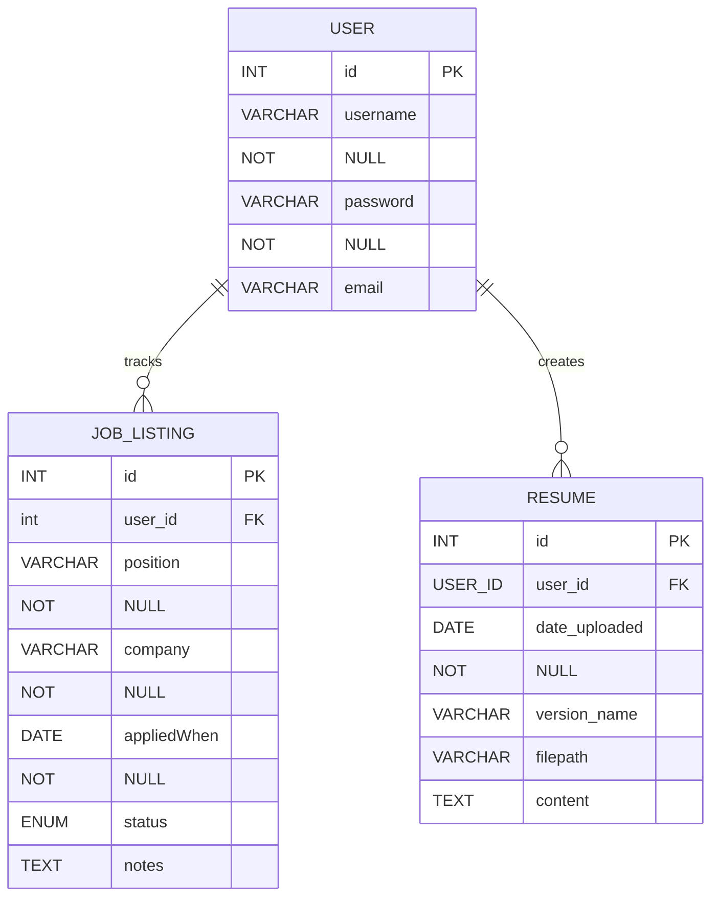
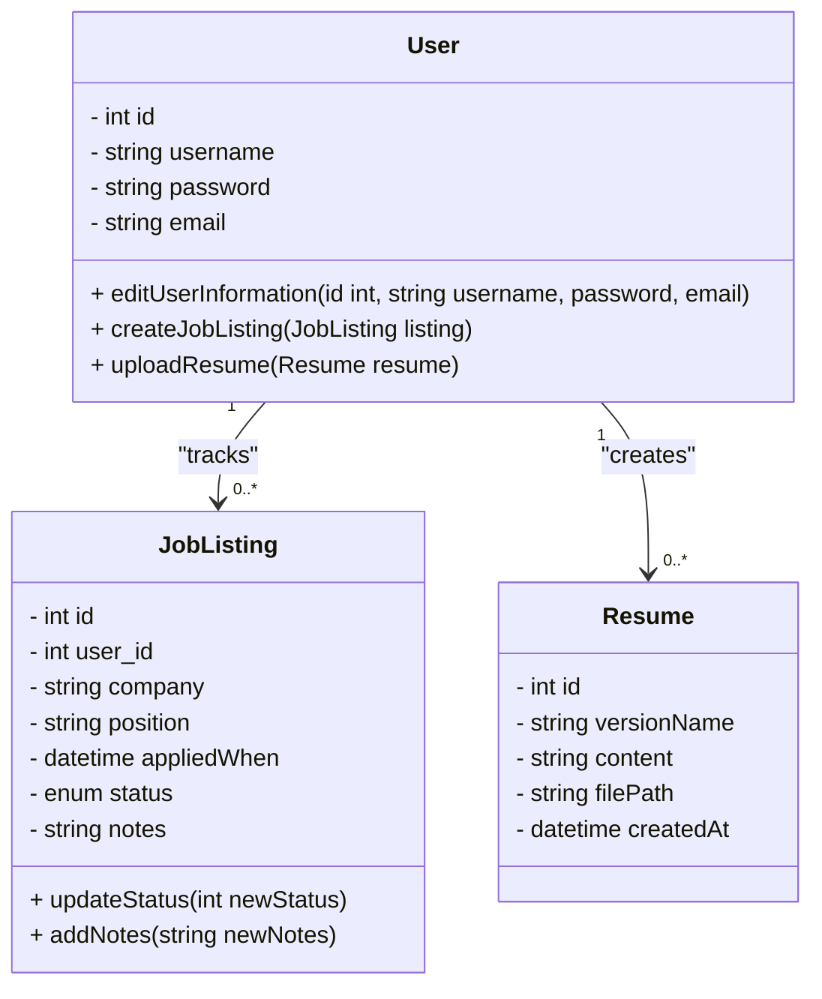

# Data

This file is responsible for representing the data structures used in ____. Below are the [Entity Relationship Diagram](#entity-relations) and the [Class Diagram](#class-diagram)

*Rendered with [Mermaid](https://mermaid.js.org/)*

## Entity Relations

## Class Diagram

